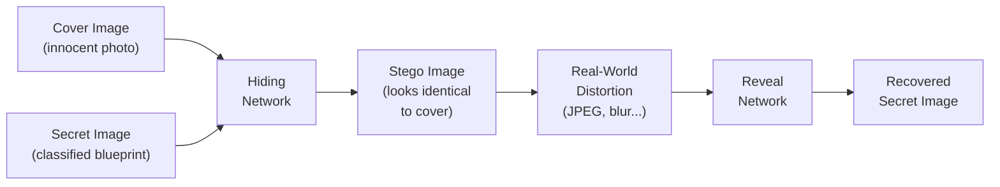
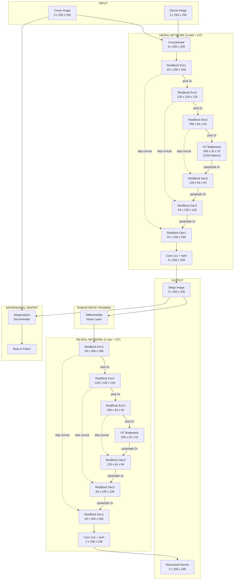
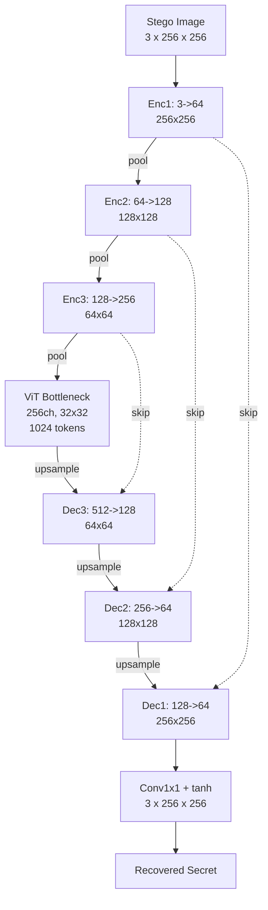
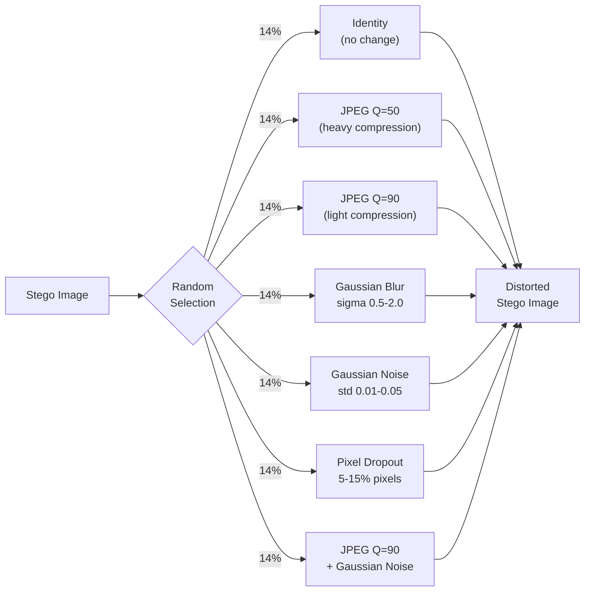
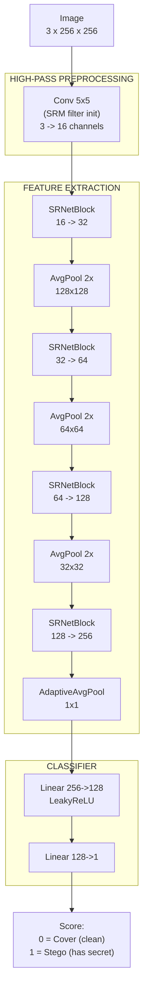

# Nexus-Steg

**A Robust Semantic-Texture Hybrid Steganography System**

Nexus-Steg treats image steganography as a *digital camouflage* problem rather than simple pixel manipulation. It combines a U-Net encoder with Vision Transformer attention, adversarial steganalysis training, and differentiable noise simulation to hide secret images inside cover images in a way that survives JPEG compression, blur, and AI-based detection.

<!--  -->

---

## Table of Contents

- [How It Works (30-Second Version)](#how-it-works-30-second-version)
- [Architecture Deep Dive](#architecture-deep-dive)
  - [Full Pipeline](#full-pipeline)
  - [HidingNetwork (Encoder)](#hidingnetwork-encoder)
  - [RevealNetwork (Decoder)](#revealnetwork-decoder)
  - [Differentiable Noise Layer](#differentiable-noise-layer)
  - [Steganalysis Discriminator (The Sentry)](#steganalysis-discriminator-the-sentry)
  - [Training Loop](#training-loop)
  - [Loss Functions](#loss-functions)
- [Project Structure](#project-structure)
- [Setup & Installation](#setup--installation)
  - [Prerequisites](#prerequisites)
  - [macOS (Apple Silicon)](#macos-apple-silicon)
  - [Windows (NVIDIA GPU)](#windows-nvidia-gpu)
- [Dataset Preparation](#dataset-preparation)
- [Training](#training)
- [Understanding the Output](#understanding-the-output)
- [Metrics](#metrics)
- [Key Design Decisions](#key-design-decisions)

---

## How It Works (30-Second Version)



**The cover image goes in looking normal. The secret image is woven into its texture. The stego image comes out looking identical to the original cover -- but it carries a hidden payload that can be extracted even after JPEG compression.**

---

## Architecture Deep Dive

### Full Pipeline

This is the complete data flow during training. During inference, the noise layer is bypassed.



---

### HidingNetwork (Encoder)

The encoder takes a **cover image** and a **secret image**, both 256x256 RGB, and produces a **stego image** that looks identical to the cover but contains the hidden secret.

```
COVER IMAGE (3ch)                SECRET IMAGE (3ch)
     |                                |
     +------------- CAT -------------+
                     |
                 6 x 256 x 256
                     |
            +--------+--------+
            |  ResBlock Enc1  |  -----> skip1 (64 x 256 x 256) -------+
            |   6 -> 64 ch   |                                        |
            +--------+--------+                                        |
                     | MaxPool 2x                                      |
                 64 x 128 x 128                                        |
                     |                                                 |
            +--------+--------+                                        |
            |  ResBlock Enc2  |  -----> skip2 (128 x 128 x 128) --+   |
            |  64 -> 128 ch  |                                    |   |
            +--------+--------+                                    |   |
                     | MaxPool 2x                                  |   |
                128 x 64 x 64                                      |   |
                     |                                             |   |
            +--------+--------+                                    |   |
            |  ResBlock Enc3  |  -----> skip3 (256 x 64 x 64) -+  |   |
            | 128 -> 256 ch  |                                 |  |   |
            +--------+--------+                                 |  |   |
                     | MaxPool 2x                               |  |   |
                256 x 32 x 32                                   |  |   |
                     |                                          |  |   |
        +------------+------------+                             |  |   |
        |     ViT BOTTLENECK      |                             |  |   |
        |  flatten -> 1024 tokens |                             |  |   |
        |  Multi-Head Attention   |  <-- Global semantic        |  |   |
        |  (8 heads, dim=256)     |      understanding          |  |   |
        |  MLP (256 -> 1024 ->256)|                             |  |   |
        |  reshape -> 256x32x32   |                             |  |   |
        +------------+------------+                             |  |   |
                     |                                          |  |   |
                     | Upsample 2x                              |  |   |
                256 x 64 x 64                                   |  |   |
                     |                                          |  |   |
                     +--- CONCAT with skip3 --> 512 x 64 x 64  |  |   |
                     |                          +               |  |   |
            +--------+--------+                                 |  |   |
            |  ResBlock Dec3  |                                    |   |
            | 512 -> 128 ch  |                                    |   |
            +--------+--------+                                    |   |
                     | Upsample 2x                                 |   |
                128 x 128 x 128                                    |   |
                     |                                             |   |
                     +--- CONCAT with skip2 --> 256 x 128 x 128   |   |
                     |                          +                      |
            +--------+--------+                                        |
            |  ResBlock Dec2  |                                        |
            | 256 -> 64 ch   |                                        |
            +--------+--------+                                        |
                     | Upsample 2x                                     |
                 64 x 256 x 256                                        |
                     |                                                 |
                     +--- CONCAT with skip1 --> 128 x 256 x 256       |
                     |                          +
            +--------+--------+
            |  ResBlock Dec1  |
            | 128 -> 64 ch   |
            +--------+--------+
                     |
            +--------+--------+
            |  Conv 1x1 + tanh |
            |   64 -> 3 ch    |
            +--------+--------+
                     |
             STEGO IMAGE (3ch)
           (looks like the cover,
            but carries the secret)
```

**Why this design?**

| Component | What It Does |
|---|---|
| **ResidualBlock** | Two 3x3 convolutions with BatchNorm + a shortcut connection. Learns local texture patterns (edges, fur, concrete grain) |
| **U-Net Skip Connections** | Directly pipes high-resolution encoder features to the decoder. Without these, fine details like individual eyelashes or text get destroyed during downsampling |
| **ViT Bottleneck** | Flattens the 32x32 feature map into 1024 tokens and runs multi-head self-attention. This gives the network *global* awareness -- it understands "this region is a face" and avoids hiding data in perceptually sensitive areas like eyes |
| **tanh Output** | Constrains the output to [-1, 1], matching the normalized input range |

---

### RevealNetwork (Decoder)

The reveal network mirrors the hiding network. It takes the stego image (3 channels) and extracts the hidden secret. Same U-Net + ViT architecture, but with 3 input channels instead of 6.



---

### Differentiable Noise Layer

This is inserted **between the encoder and decoder during training only**. It simulates real-world image degradation so the decoder learns to recover secrets even from corrupted stego images.



Each distortion uses a **straight-through estimator** so gradients can flow back through the non-differentiable quantization steps. During inference (eval mode), this layer becomes an identity pass-through.

---

### Steganalysis Discriminator (The Sentry)

The Sentry is trained to detect whether an image contains hidden data. It plays a zero-sum game against the encoder -- as the Sentry gets better at detecting, the encoder evolves to hide better.



The first layer is initialized with **SRM (Spatial Rich Model) high-pass filters** -- the same kernels used in professional steganalysis forensics. This forces the discriminator to look at pixel-level residuals rather than image content, making it a much harder adversary.

---

### Training Loop

```mermaid
sequenceDiagram
    participant D as Discriminator
    participant E as Encoder (HidingNet)
    participant N as Noise Layer
    participant R as Decoder (RevealNet)
    participant L as Loss Functions

    Note over D,L: === Each Training Step ===

    rect rgb(40, 40, 60)
    Note over D: Step 1: Train Discriminator
    E->>D: Generate stego (detached, no grad)
    D->>D: Score real covers -> should be 1
    D->>D: Score stego images -> should be 0
    D->>L: BCE Loss on both
    L-->>D: Update discriminator weights
    end

    rect rgb(40, 60, 40)
    Note over E,R: Step 2: Train Generator (Encoder + Decoder)
    E->>E: Generate stego from cover + secret
    E->>N: Pass stego through noise
    N->>R: Distorted stego to decoder
    R->>R: Extract revealed secret

    E->>L: MSE(stego, cover) -- invisibility
    E->>L: VGG Perceptual(stego, cover) -- style match
    R->>L: MSE(revealed, secret) -- recovery
    E->>D: Score stego -> should fool into 1
    D->>L: Adversarial loss

    L-->>E: Update encoder weights
    L-->>R: Update decoder weights
    end

    Note over D,L: Repeat for all batches, then step LR schedulers
```



---

### Loss Functions

The total generator loss combines four objectives:

```
Total Loss = L_invisibility + 5.0 * L_recovery + 0.01 * L_adversarial
```

| Loss | Formula | Purpose | Weight |
|---|---|---|---|
| **MSE Invisibility** | `MSE(stego, cover)` | Pixel-level similarity between stego and cover | 1.0 |
| **VGG Perceptual** | `MSE(VGG(stego), VGG(cover))` | High-level feature similarity (textures, style) | 0.1 |
| **MSE Recovery** | `MSE(revealed, secret)` | Accurate extraction of the hidden secret | 5.0 |
| **Adversarial** | `BCE(D(stego), 1)` | Fool the steganalysis discriminator | 0.01 |

The VGG perceptual loss properly converts from the training range [-1, 1] to ImageNet normalization before computing features, ensuring meaningful style comparison.

---

## Project Structure

```
nexus-steg/
├── main.py                          # Entry point -- training orchestration
├── pyproject.toml                   # Dependencies and project metadata
├── src/
│   ├── core/
│   │   └── device.py                # Hardware detection (CUDA / MPS / CPU)
│   ├── data/
│   │   └── pipeline.py              # Dataset loading, TIFF support, transforms
│   ├── engine/
│   │   └── trainer.py               # Training loop, losses, validation, metrics
│   └── models/
│       ├── hybrid_transformer.py    # HidingNetwork + RevealNetwork (U-Net + ViT)
│       ├── noise_layer.py           # Differentiable JPEG, blur, noise, dropout
│       └── discriminator.py         # SRNet-inspired steganalysis discriminator
├── datasets/
│   ├── cover/                       # Place cover images here (PNG/JPG)
│   └── secret/
│       ├── MUL-PanSharpen/          # Place secret images here (TIFF/PNG/JPG)
│       └── geojson/buildings/       # SpaceNet GeoJSON annotations
├── checkpoints/                     # Saved model weights per epoch
├── results/                         # Visual comparison images per epoch
└── AOI_3_Paris_Train/               # SpaceNet Paris metadata
```

---

## Setup & Installation

### Prerequisites

- Python 3.11+
- [uv](https://docs.astral.sh/uv/) package manager (recommended) or pip
- **macOS**: Apple Silicon Mac (M1/M2/M3/M4) -- uses MPS acceleration
- **Windows**: NVIDIA GPU with CUDA 12+ -- uses CUDA acceleration
- **CPU**: Works on any machine (slower training)

### macOS (Apple Silicon)

```bash
# Clone the repository
git clone <repo-url> nexus-steg
cd nexus-steg

# Create virtual environment and install dependencies
uv sync

# Verify MPS is available
uv run python -c "import torch; print('MPS:', torch.backends.mps.is_available())"
```

### Windows (NVIDIA GPU)

```bash
# Clone the repository
git clone <repo-url> nexus-steg
cd nexus-steg

# Create virtual environment and install dependencies
uv sync

# Verify CUDA is available
uv run python -c "import torch; print('CUDA:', torch.cuda.is_available())"
```

**Alternative (pip):**

```bash
python -m venv .venv

# macOS / Linux
source .venv/bin/activate

# Windows
.venv\Scripts\activate

pip install torch torchvision tqdm pillow tifffile
```

---

## Dataset Preparation

You need two sets of images:

| Folder | What Goes Here | Recommended Source |
|---|---|---|
| `datasets/cover/` | Natural photographs (the "innocent" carriers) | [MS-COCO](https://cocodataset.org/) val2017 or train2017 |
| `datasets/secret/MUL-PanSharpen/` | The images to hide (satellite imagery, blueprints, etc.) | [SpaceNet](https://spacenet.ai/) Paris MUL-PanSharpen TIFF files |

**Quick start with MS-COCO covers:**

```bash
# Download COCO val2017 (about 1GB, 5000 images)
mkdir -p datasets/cover
cd datasets/cover
curl -O http://images.cocodataset.org/zips/val2017.zip
unzip val2017.zip
mv val2017/* .
rmdir val2017
rm val2017.zip
cd ../..
```

**For SpaceNet secrets**, download the Paris AOI_3 MUL-PanSharpen images from [SpaceNet on AWS](https://spacenet.ai/datasets/) and place the `.tif` files in `datasets/secret/MUL-PanSharpen/`.

> Both folders must contain at least 1 image each. The pipeline supports `.png`, `.jpg`, `.jpeg`, `.tif`, and `.tiff` formats.

---

## Training

```bash
# Run training (100 epochs by default)
uv run python main.py

# Or with the venv directly
.venv/bin/python main.py        # macOS / Linux
.venv\Scripts\python main.py    # Windows
```

**What happens when you run it:**

1. Hardware auto-detection (CUDA > MPS > CPU)
2. Dataset loading and validation
3. Training with live progress bars showing loss values
4. Per-epoch validation with PSNR and SSIM metrics
5. Visual comparisons saved to `results/epoch_N.png`
6. Full checkpoints saved to `checkpoints/nexus_epoch_N.pth`

**Example output:**

```
CUDA is available. Using GPU.
Cover path: .../datasets/cover | Found: 5000 images
Secret path: .../datasets/secret/MUL-PanSharpen | Found: 1000 images
Starting Nexus-Steg Training on cuda

Epoch 0/100: 100%|████████████████| 500/500 [02:31, loss=3.4521, inv=1.2340, rec=0.4436, disc=0.6931]
  Val | PSNR(stego): 24.31dB  SSIM(stego): 0.8821  PSNR(secret): 18.42dB  SSIM(secret): 0.7103

Epoch 50/100: 100%|████████████████| 500/500 [02:28, loss=0.8912, inv=0.3201, rec=0.1142, disc=0.5823]
  Val | PSNR(stego): 35.67dB  SSIM(stego): 0.9712  PSNR(secret): 30.21dB  SSIM(secret): 0.9534
```

---

## Understanding the Output

### Visual Results (`results/epoch_N.png`)

Each saved image is a side-by-side strip of four images:

```
┌──────────┬──────────┬──────────┬──────────┐
│  Cover   │  Secret  │  Stego   │ Revealed │
│(original)│ (hidden) │ (output) │(extracted)│
└──────────┴──────────┴──────────┴──────────┘
```

- **Cover vs. Stego** should look nearly identical (high PSNR = good hiding)
- **Secret vs. Revealed** shows how well the decoder recovers the hidden image

### Checkpoints (`checkpoints/nexus_epoch_N.pth`)

Each checkpoint contains:

```python
{
    "epoch": 50,
    "hiding_net": ...,       # Encoder weights
    "reveal_net": ...,       # Decoder weights
    "discriminator": ...,    # Sentry weights
    "optimizer_g": ...,      # Generator optimizer state (for resuming)
    "optimizer_d": ...,      # Discriminator optimizer state
    "scheduler_g": ...,      # LR scheduler state
    "scheduler_d": ...,
    "scaler": ...,           # AMP scaler state
}
```

---

## Metrics

| Metric | What It Measures | Good Value |
|---|---|---|
| **PSNR (stego)** | How similar the stego image is to the cover (pixel-level) | > 33 dB |
| **SSIM (stego)** | Structural similarity between stego and cover | > 0.95 |
| **PSNR (secret)** | How accurately the secret is recovered | > 28 dB |
| **SSIM (secret)** | Structural similarity of recovered vs. original secret | > 0.90 |
| **Disc Loss** | Discriminator's ability to detect stego (~0.69 = fooled) | ~0.5 - 0.7 |

---

## Key Design Decisions

| Problem | Common Approach | Nexus-Steg Solution |
|---|---|---|
| JPEG destroys the hidden data | Ignore it | **Differentiable JPEG Layer** trained directly into the loss function with straight-through estimator |
| Color shifts in stego image | Simple L2 loss | **VGG-16 Perceptual Loss** with proper ImageNet normalization for natural color/texture preservation |
| AI steganalysis detects the secret | No defense | **Adversarial training** against an SRNet-inspired discriminator with SRM high-pass filter initialization |
| Fine details lost in bottleneck | Basic encoder-decoder | **U-Net skip connections** at 3 resolution levels preserving full spatial detail |
| CNN misses global image context | Pure CNN | **Vision Transformer bottleneck** with multi-head self-attention over 1024 spatial tokens |
| Training instability with GAN + ViT | Hope for the best | **Gradient clipping** (max_norm=1.0), **spectral normalization**, and **cosine LR annealing** |
| Slow training | Wait a week | **Mixed-precision (AMP)** on CUDA with GradScaler for ~2x speedup |
| Mac vs Windows compatibility | Pick one | **Auto-detection**: CUDA on Windows, MPS on Apple Silicon, CPU fallback |
